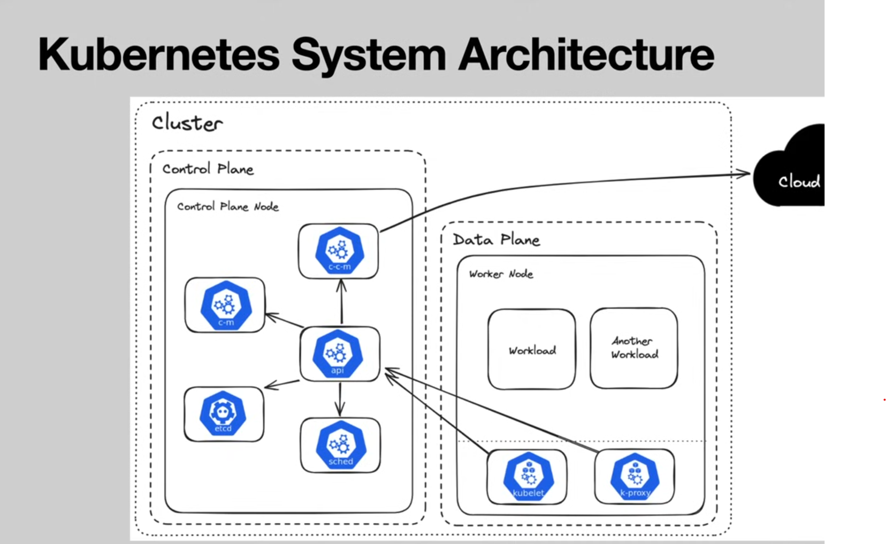
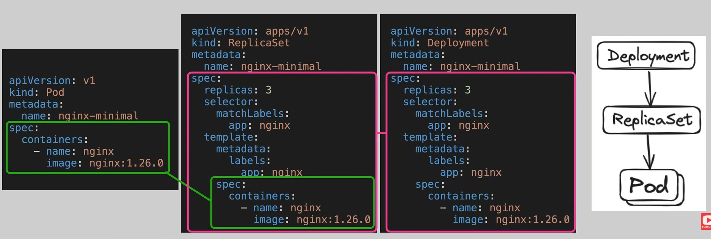

# [Complete Kubernetes Course - From BEGINNER to PRO](https://www.youtube.com/watch?v=2T86xAtR6Fo&t=849s)

## Prerequisites
- Familiarity with web applications (the course examples are in JavaScript, Golang, and Python)
- Basic shell commands (enough to build run an application in language of your choosing on Linux)
- Basic cloud infrastructure knowledge
- Intermediate container knowledge

## Course Overview
### Part 1:
1. History and Motivation
1. Technology Overview
1. Installation/Set Up
1. Built-in Kunernetes Resource Types
1. Helm

### Part 2:
6. Demo Application
1. Deploying Demo Application to Kubernetes
1. Extending the Kunernetes API
1. Deploying Auxiliary Tooling
1. Developer Experience
1. Debugging
1. Deploying to Multiple environments
1. Cluster/node upgrades
1. CI/CD
1. What's next? (out of scope)

### Demo Application
Minimal 3 Tier web Application:
- React Front End
- Two API implementations:
    - Node.js (interpreted)
    - GO (compiled)
- Python Load Generator
- PostgreSQL Database


## Module 1: Histroy and Motivation


## Module 2: Technology Overview

### Kubernetes System Architecture
- Cluster: 
- Nodes
- Control Plane
- Data Plane

</img>

- Cloud Controller Manager: Interface between K8s and cloud provider.
- Controller Manager: runs all of the various controllers that regulate the state of the cluster.
- API:
- etcd: Data store
- scheduler:

### Kubernetes Standard Interfaces
Interfaces:
- Container Runtime Interface (CRI)
    - containerd
    - cri-o
- Container Network Interface (CNI)
    - Calico
    - Flannel
    - Cilium
    - Cloud specific CNI plugins
        - Amazon VPC CNI
        - Azure CNI
        - Google Cloud CNI
- COntainer Storage Interface (CSI)
    - Cloud specific CSI Driver
        - Amazon EBS CSI Driver
        - Compute Engine persistent disk CSI Driver
        - Azure Disk Container CSI Driver
    - Cert manager CSI Driver
    - Secrets Store CSI Driver

Defining these interfaces allows for a modular system where innovation can happen outside of the main Kubernetes project and be easily "plugged in" or swapped to achieve new functionality.

Checkout for more tooling on [CNCF Landscape](https://landscape.cncf.io/)


## Module 3: Installation and Set Up

### Tools will be used
- `Docker Desktop`: Container development (https://docs.docker.com/get-docker/)
- `DevBox`: https://www.jetify.com/devbox/docs/quickstart/
    - Use the provided Devbox config files to create an isolated environment containing all of the tools.
    - install devbox
        > ```bash
        > curl -fsSL https://get.jetify.com/devbox | bash
        > ```
    - `devbox.json`: listing of all the different CLI tools that will be used.
    - `devbox.lock`: contains the specific versions so that you will be guaranteed to get the exact version.
    - usage:
        ```bash
        # create a shell containing all the dependencies defined in the devbox configuration files, i.e., `devbox.json` and `devbox.lock`.
        devbox shell

        # to exit the devbox shell
        exit

        # display all the dependencies installed within the current shell session
        devbox list
        ```
    - naviage to `03-installation-and-setup`
        ```bash
        (dev)$ task --list-all
        ```
    - create config file:
        ```bash
        task kind:01
        ```
    - create kind cluster with one control plane and two worker nodes
        ```bash
        task kind:02
        ```
    - install [cloud-provider-kind](https://github.com/kubernetes-sigs/cloud-provider-kind), this will enable us to run load balancer within the kind cluster such that we'll be able to access it from the host
        ```bash
        task kind:03
        ```
    - delete cluster
        ```bash
        task kind:04-delete-cluster
        ```
- `task`: 
    - Doc: https://taskfile.dev/docs/installation
    - GitRepo: https://github.com/go-task/task
- [`helm`](https://helm.sh/): Package manager / template engine
- `kubectl`: Kubernetes client
- `kubectx`: kubectl add-on to make cluster switching easier
- `kluctl`: Improving Kubernetes configuration management
- [`KinD`](https://kind.sigs.k8s.io/): Deploy Kubernetes within Docker
- `ko`: Containerizing go applications
- `k9s`: TUI for observing kubernetes clusters
- `oras`: OCI registry client
- `yq`: Parsing and manipulating yaml

### Create a KinD Cluster
- Simple local cluster for development
- Supports multiple nodes (each node is a container)
    - one node as control plane
    - two worker nodes
- will work for most examples

```bash
task --list-all
# or
tl # alias tl = task --list-all
```

```bash
kubectl get pods -A
```


### Deploy Remote clusters on various Cloud providers
Cloud Providers:
- Civo
    - simple, cloud-based cluster
    - Fastest cluster creation in the business
    - 1 Month/ 250$ free credit for new users
    - Will allow us to demonstrate:
        - More realistic networking
        - Public load balancers
        - Persistent storage
    
- GKE (Google Kubernetes Engine)
    - (IMO) The best managed cluster experience
    - Two modes: Standard and Autopilot
    - 90-day/ $300 free trial for new users
    - 1 zonal cluster (control plane) within free tier
    - Will allow us to demonstrate
        - More realistic nerworking
        - Public load balancers
        - Multiple Persistent storage classes
        - Workload monitoring (out of the box)

## Module 4 Built-in Kubernetes Resources

- This section is meant to give you awareness of the different types of resources within Kubernetes and their use cases.
- We will revisit many of them in more detail in the context of the demo application later in the course.
- You should leave this section with a high level understanding of the building blocks, and that understanding will solidify as you actually use them in the following sections.

### Namespace
- Provides a mechanism to group resources within a cluster
- There are 4 initial namespaces: *default*, *kube-system*, *kube-node-lease*, *kube-public*
- By default, namespaces DO NOT act as a network/security boundary

- Create a namespace using CLI (in more of an imperative fashion):
    ```bash
    kubectl create namespace <namespace-name>
    kubectl get namesapces
    ```

- We can store the definitions of the resources in Git. We do so by putting the definition within a YAML file and then we can instead of running the create command. We can run the apply command so `kubectl apply -f` for file and then pass it the name of that resource configuration. 

    ```bash
    kubectl apply -f <resource-definition.yaml>
    ```

    In general it is preferred to store the definition of your resources within your code base rather than creating them on the command line imperatively.


### Pod
- The "smallest deployable unit"
- You will almost never create a pod directly
- Example:
    ```yaml
    # minimal example of a Pod resource
    apiVersion: v1 # kubernetes api version
    kind: Pod # resource type
    metadata:
        name: nginx-minimal # name of the Pod
    spec: # specify one or more contaienrs
        containers:
            - name: nginx # name of the contaienr
              image: nginx:1.26.0 # image reference
    ```
- A Pod can contain multiple containers
- Containers within a Pod share networking and storage
- Init Containers
- Sidecar containers
- There are many more configurations available:
    - Listening ports
    - Health probes
    - Resources requests/limits
    - Security Context
    - Environment variables
    - Volumes
    - DNS Policies
- Deleting a Namespace will recursively delete all the Pods defined in it.

### ReplicaSet
The ReplicaSet takes a pod definition and wraps it in another layer adding the concept of replicas. Then you can specify from one to n replicas. There's a controller within that Kube Controller Manager that's going to ensure that we have however many replicas specified instances of that Pod Running at all time.

- Adds the concept of "replicas"
- You will almost never create a ReplicaSet directly
- Labels are the link between RepliaSets and Pods
- Example
    
    ```yaml
    apiVersion: apps/v1
    kind: ReplicaSet
    metadata:
      name: nginx-minimal
    spec:
      replicas: 3
      selector:
        matchLabels:
          app: nginx # Label
      template: # Pod template
        metadata:
          labels:
          app: nginx # Label
        
        # Definition of the Pod
        spec:
          containers:
            - name: nginx
              image: nginx:1.26.0
    ```

### Deployment
- In Deployment you can define the strategy for handling rollouts and the revision history limit for how many older versions you want to keep around.  

- Adds the concept of "rollouts" and "rollbacks". So you can specify how you want the pods to change as you go from one version of the deployment to the next. 

- Used for long-running stateless applications



